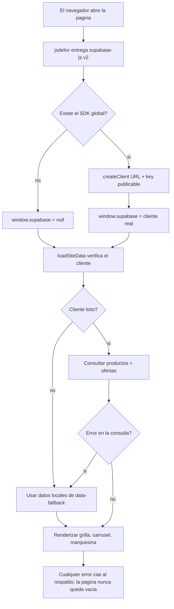
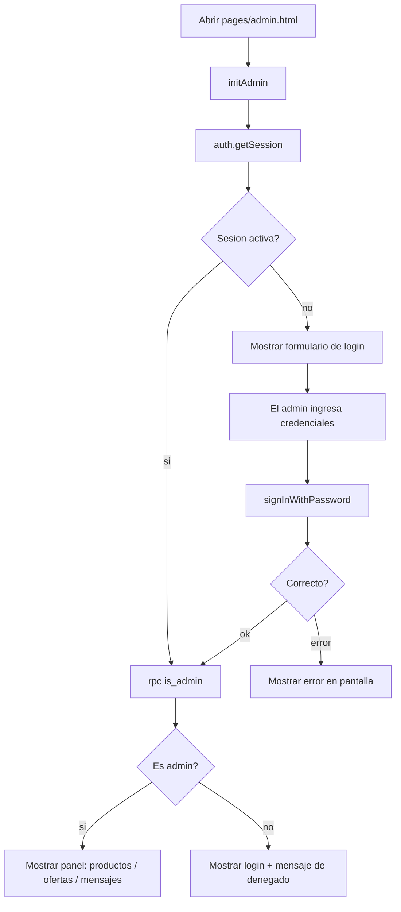
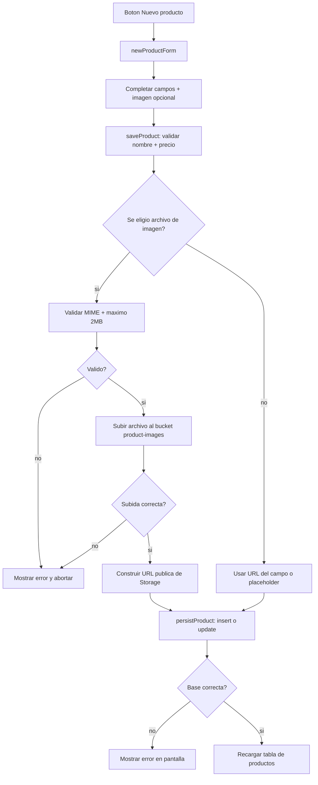
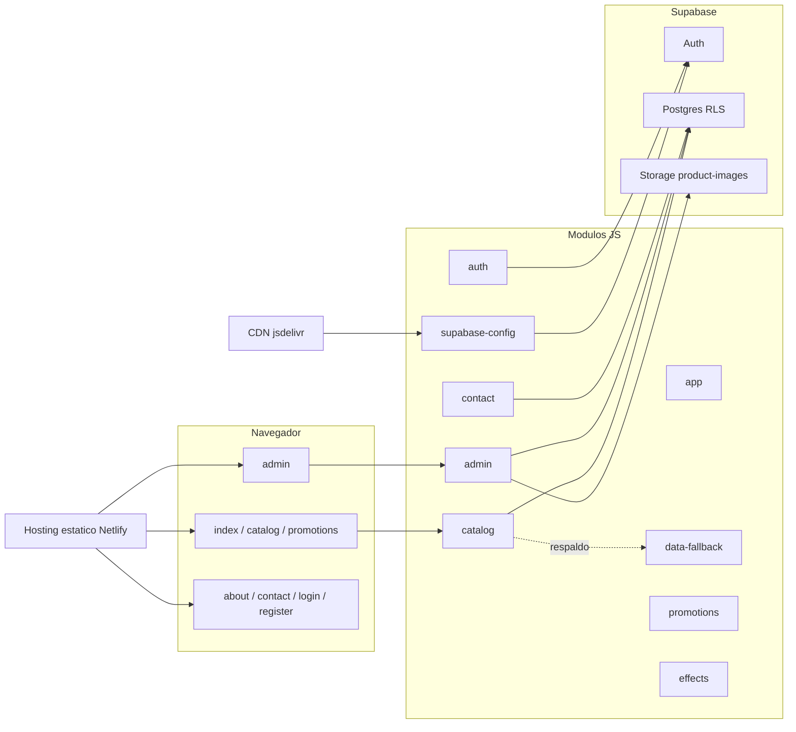
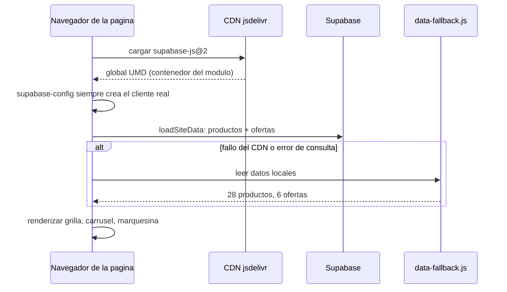
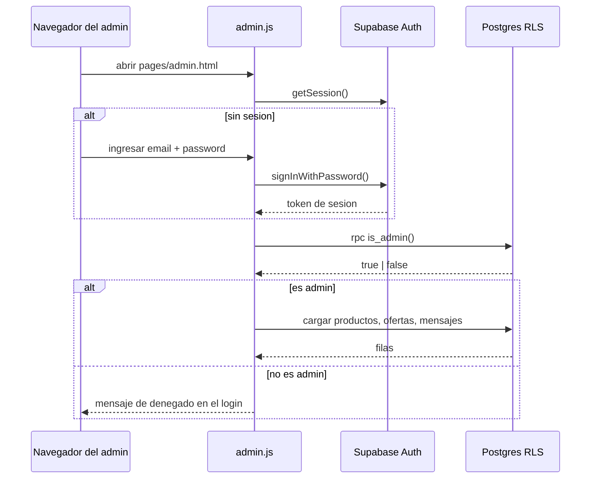
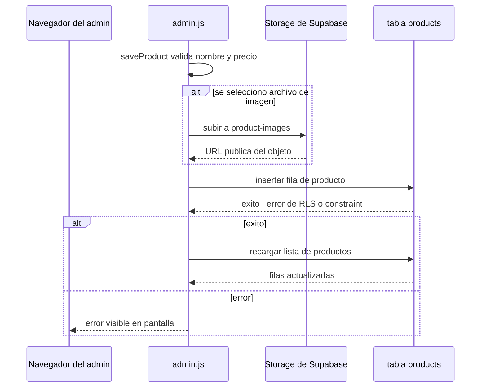

# laSolutions Website — Diagramas de arquitectura

Diagramas de la tienda laSolutions (HTML/CSS/JS vanilla + Supabase +
Netlify). Tres vistas: flujos, componentes y secuencias.

**Como verlos:** GitHub renderiza los bloques Mermaid de forma nativa. De
forma local, usa VS Code con las extensiones *Markdown Preview Mermaid
Support* y *Markmap*, o pega los bloques Mermaid en <https://mermaid.live>.

---

## Mapa del proyecto (markmap)

````markmap
# Sitio laSolutions
## Frontend (public/)
### Paginas
- index · catalog · promotions · admin · about · contact · login · register
### Modulos JS compartidos
- supabase-config: fabrica del cliente (+ respaldo)
- app: navegacion, helpers compartidos, resolveImageUrl
- auth: flujo de sesion con Supabase Auth
- catalog: loadSiteData, render, carrusel, marquesina de marcas
- promotions: tarjetas de ofertas + cuenta regresiva
- data-fallback: espejo local (28 productos, 6 ofertas)
- contact: submitContactMessage
- admin: panel (CRUD + mensajes + subida de imagenes)
- effects: pop-out 3D + hero flotante
### CSS
- style · gaming-theme · effects
## Backend (Supabase)
### Postgres (schema.sql)
- products · promotions · contact_messages · admin_users
- is_admin() SECURITY DEFINER · RLS solo-admin para escrituras
### Auth
- registro / inicio de sesion / sesiones
### Storage
- bucket product-images (lectura publica, escritura admin)
## Hosting
- Netlify estatico desde /public · auto-deploy desde GitHub master
## Docs
- openspec (config, project, changes)
````

---

## Flujos

### Carga de pagina publica con respaldo resiliente



### Login de administrador y acceso al panel



### Creacion de producto con subida de imagen opcional



---

## Componentes



## Secuencias

### Carga del catalogo publico



### Login de administrador y autorizacion



### Creacion de producto con subida de imagen

