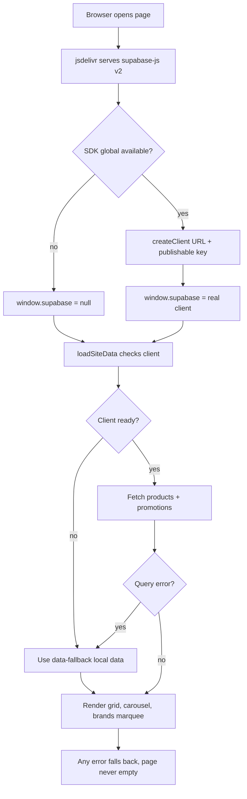
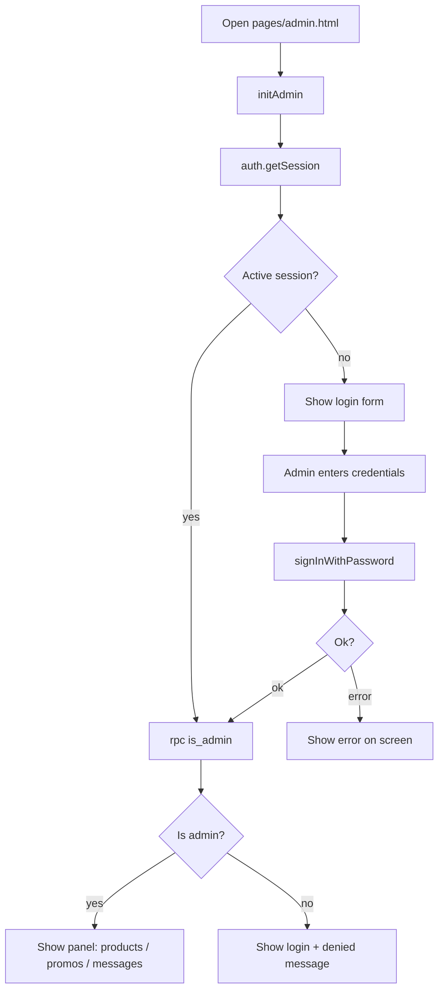
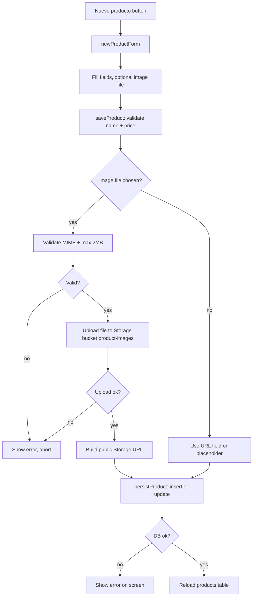
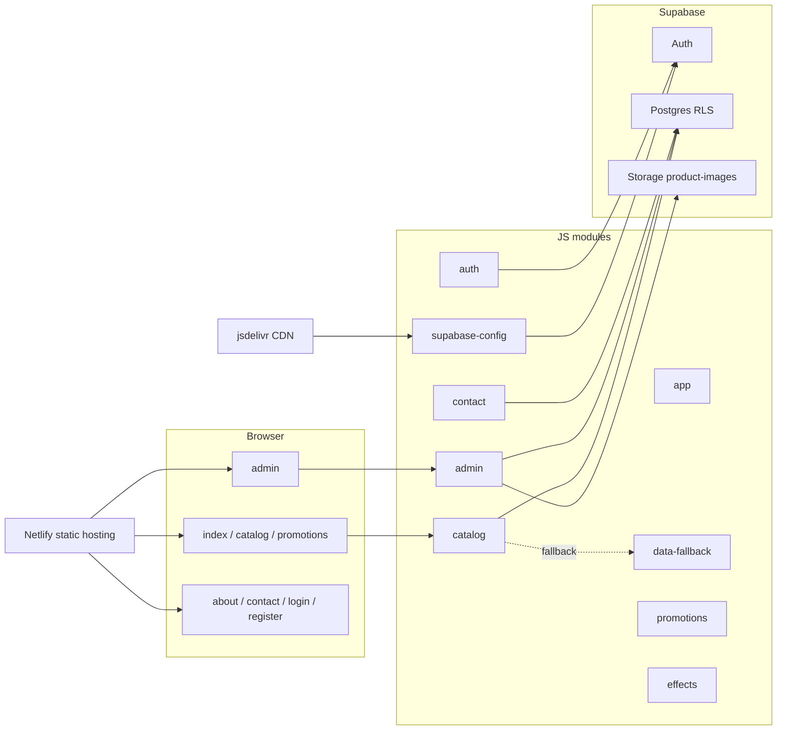
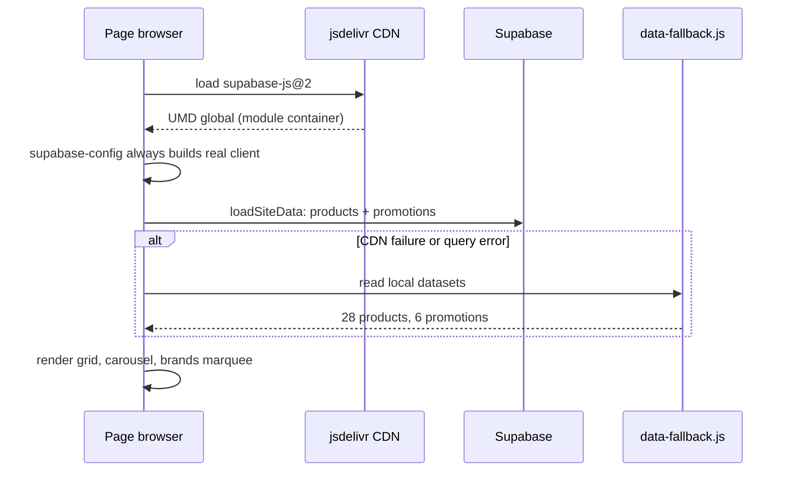
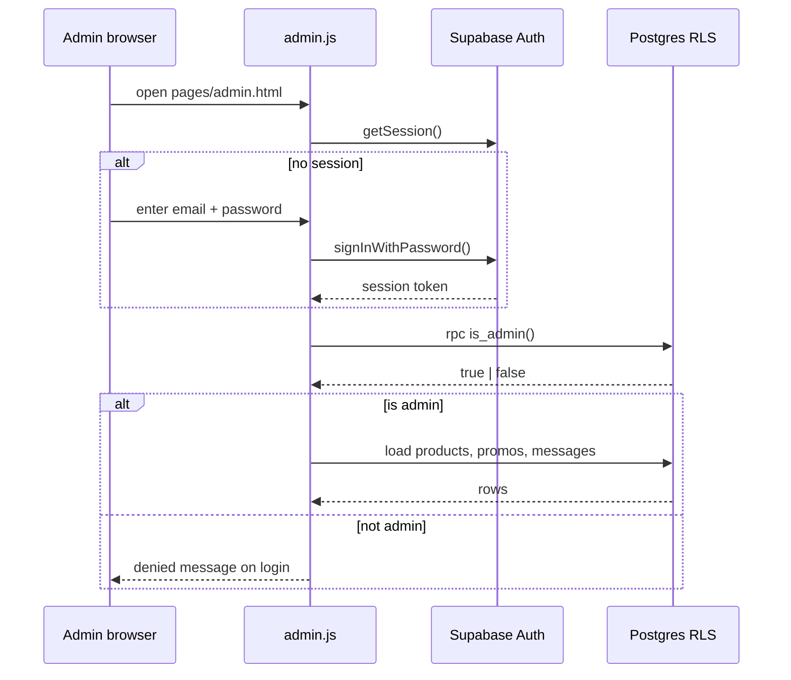
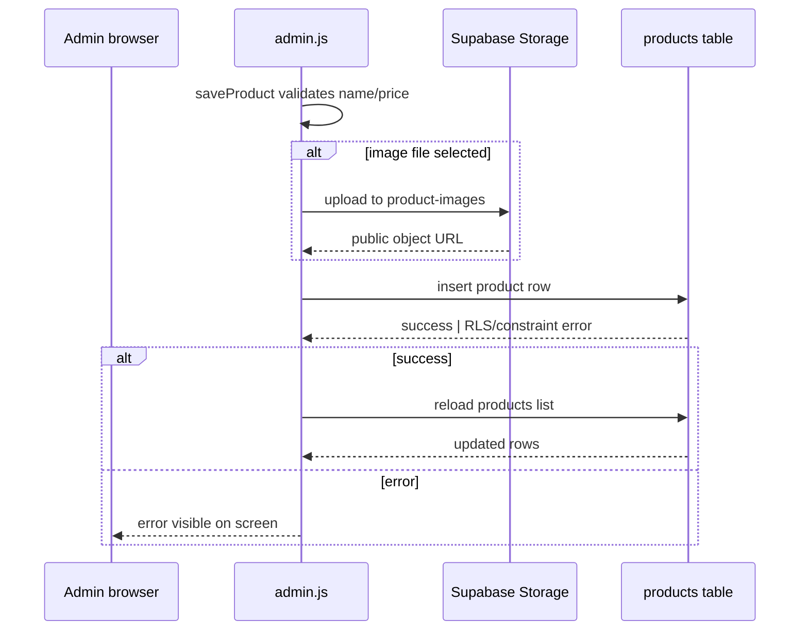

# laSolutions Website — Architecture Diagrams

Diagrams for the laSolutions storefront (vanilla HTML/CSS/JS + Supabase +
Netlify). Three views: flows, components, and sequences.

**How to view:** GitHub renders Mermaid blocks natively. Locally, use VS Code
with *Markdown Preview Mermaid Support* + *Markmap* extensions, or paste the
Mermaid blocks into <https://mermaid.live>.

---

## Project map (markmap)

````markmap
# laSolutions Website
## Frontend (public/)
### Pages
- index · catalog · promotions · admin · about · contact · login · register
### Shared JS modules
- supabase-config: client factory (+ fallback)
- app: nav, shared helpers, resolveImageUrl
- auth: Supabase Auth session flow
- catalog: loadSiteData, render, carousel, brands marquee
- promotions: promo cards + countdowns
- data-fallback: local mirror (28 products, 6 promos)
- contact: submitContactMessage
- admin: panel (CRUD + messages + image upload)
- effects: 3D pop-out + floating hero
### CSS
- style · gaming-theme · effects
## Backend (Supabase)
### Postgres (schema.sql)
- products · promotions · contact_messages · admin_users
- is_admin() SECURITY DEFINER · RLS admin-only writes
### Auth
- sign up / login / sessions
### Storage
- product-images bucket (public read, admin write)
## Hosting
- Netlify static from /public · auto-deploy from GitHub master
## Docs
- openspec (config, project, changes)
````

---

## Flows

### Public page load with resilient fallback



### Admin login and panel access



### Product creation with optional image upload



---

## Components



## Sequences

### Public catalog load



### Admin login and authorization



### Product creation with image upload

